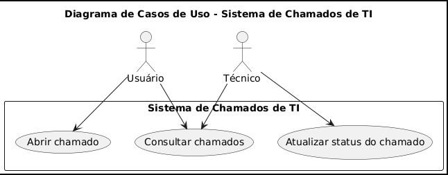

# Índice

- [Índice](#índice)
- [1. Descrição do Cenário / Problema](#1-descrição-do-cenário--problema)
- [2. Requisitos](#2-requisitos)
- [3. Arquitetura do Sistema](#3-arquitetura-do-sistema)
- [4. Modelagem UML](#4-modelagem-uml)
  - [Diagrama de Casos de Uso](#diagrama-de-casos-de-uso)
  - [Diagrama de Classes](#diagrama-de-classes)
- [5. Persistência de Dados](#5-persistência-de-dados)
  - [Estratégia adotada](#estratégia-adotada)
  - [Modelo de Dados](#modelo-de-dados)

---

# 1. Descrição do Cenário / Problema

A área de TI de empresas frequentemente recebe solicitações técnicas, como erros em sistemas, falhas de hardware ou pedidos de acesso. Sem um sistema centralizado, essas demandas são controladas por e-mail ou informalmente, o que resulta em perda de informações, falta de prioridade e dificuldade em acompanhar os atendimentos.

O sistema proposto tem como objetivo resolver esse problema, fornecendo uma aplicação para registrar, acompanhar e resolver chamados de TI com controle, rastreabilidade e eficiência.

---

# 2. Requisitos

**Requisitos Funcionais**  
RF01 – Permitir o cadastro de usuários (funcionários, técnicos e administradores)  
RF02 – Permitir login com autenticação segura  
RF03 – Permitir que usuários abram chamados  
RF04 – Permitir listagem e consulta de chamados  
RF05 – Permitir que técnicos atualizem o status dos chamados  
RF06 – Permitir geração de relatórios (em fases futuras)  

**Requisitos Não Funcionais**  
RNF01 – A aplicação deve ser uma API RESTful  
RNF02 – Utilizar Python com FastAPI e PostgreSQL  
RNF03 – As senhas devem ser armazenadas com hash seguro  
RNF04 – O sistema deve utilizar o padrão DAO e SQLAlchemy 2.0  
RNF05 – O sistema deve suportar requisições assíncronas  

---

# 3. Arquitetura do Sistema

O sistema foi implementado usando o padrão MVC adaptado + DAO:

- **Models:** definem a estrutura dos dados com SQLAlchemy
- **DAO (Data Access Object):** responsáveis pelo acesso ao banco
- **Schemas:** validam e estruturam os dados com Pydantic
- **Controllers:** definem as rotas da API
- **DB Config:** módulo central de conexão com PostgreSQL

A arquitetura foi escolhida por oferecer alta coesão, separação de responsabilidades e permitir fácil manutenção e expansão do sistema.

---

# 4. Modelagem UML

## Diagrama de Casos de Uso

  

## Diagrama de Classes

  

---

# 5. Persistência de Dados

## Estratégia adotada

Banco de dados relacional: PostgreSQL  
ORM: SQLAlchemy 2.0 com asyncpg  
Migrações: Alembic (ainda por configurar)  
Padrão DAO: usado para isolar lógica de acesso ao banco  

Essa abordagem permite escalabilidade, fácil manutenção e segurança, além de aproveitamento de transações, constraints e relacionamentos do PostgreSQL.

## Modelo de Dados

  

